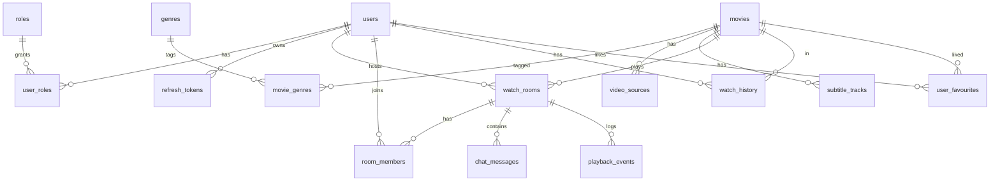

# ER diagram (matches `V1__initial_schema.sql`)

```mermaid
erDiagram
  users ||--o{ user_roles : has
  roles ||--o{ user_roles : grants
  users ||--o{ refresh_tokens : owns
  movies ||--o{ movie_genres : tagged
  genres ||--o{ movie_genres : tags
  movies ||--o{ video_sources : has
  movies ||--o{ subtitle_tracks : has
  users ||--o{ watch_rooms : hosts
  movies ||--o{ watch_rooms : plays
  watch_rooms ||--o{ room_members : has
  users ||--o{ room_members : joins
  watch_rooms ||--o{ chat_messages : contains
  watch_rooms ||--o{ playback_events : logs
  users ||--o{ watch_history : has
  movies ||--o{ watch_history : in
  users ||--o{ user_favourites : likes
  movies ||--o{ user_favourites : liked
```
